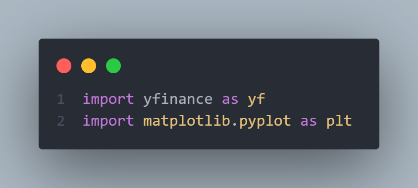
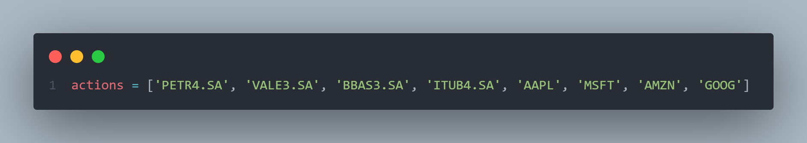
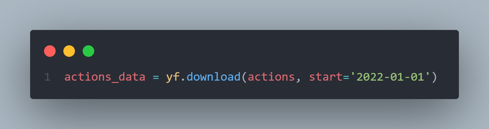
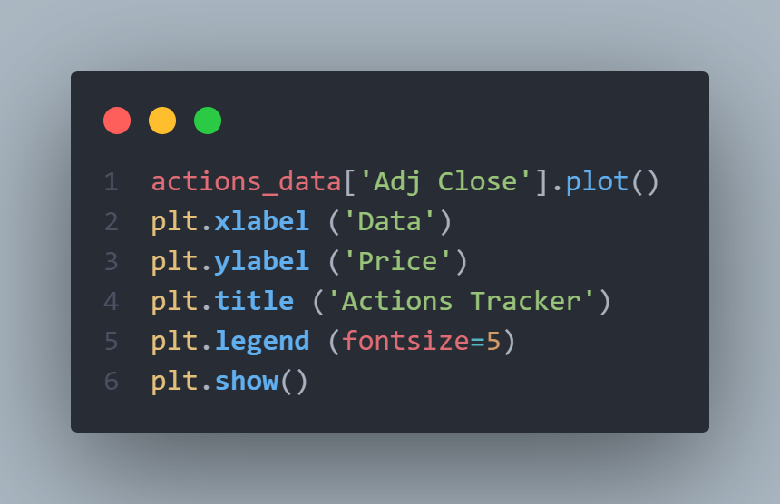
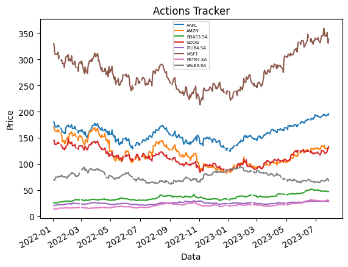
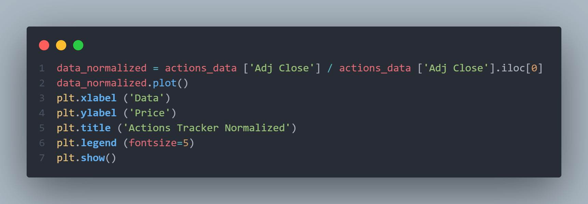
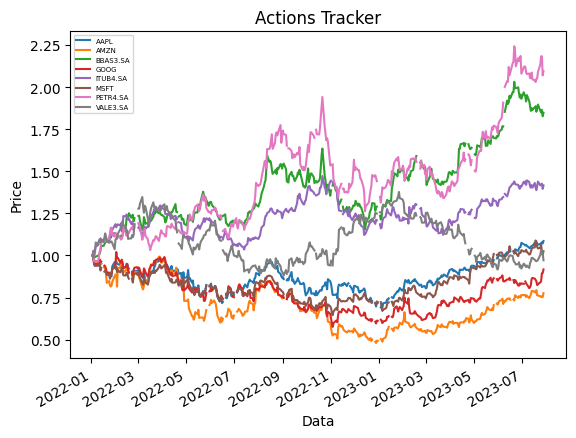

## Instalação

Para usar este script, você precisará ter o Python 3 instalado em seu computador. Além disso, você precisará instalar as bibliotecas `yfinance` e `matplotlib`. Isso pode ser feito usando o seguinte comando:

```
pip install yfinance matplotlib
```
- Importando bibliotecas: Este trecho de código importa as bibliotecas `yfinance` e `matplotlib.pyplot`, que são usadas para obter dados financeiros e criar gráficos, respectivamente.


## Uso

Para usar este script, basta executá-lo a partir da linha de comando. O script irá baixar automaticamente os dados financeiros das ações especificadas e criar gráficos mostrando o desempenho dessas ações ao longo do tempo.

Você pode modificar a lista de ações rastreadas alterando a variável `actions` no início do script. Além disso, você pode modificar o período de tempo para o qual os dados são baixados alterando o valor do parâmetro `start` na chamada para a função `download`.

- Definindo ações do portfólio: Este trecho de código define uma lista de ações que serão usadas no restante do script. As ações são especificadas usando seus símbolos de ticker.


- Importando dados de ativos financeiros: Este trecho de código usa a função `download` da biblioteca `yfinance` para obter dados históricos das ações especificadas na lista `actions`. Os dados são obtidos a partir de 1º de janeiro de 2022.


- Criando o gráfico: Este trecho de código cria um gráfico mostrando o preço ajustado de fechamento das ações ao longo do tempo. O gráfico é criado usando funções da biblioteca `matplotlib.pyplot`.



- Normalizando preços: Este trecho de código normaliza os preços das ações dividindo cada preço pelo preço inicial. Em seguida, um novo gráfico é criado mostrando os preços normalizados ao longo do tempo.



## Contribuindo

Contribuições são sempre bem-vindas! Se você tiver alguma sugestão ou correção, sinta-se à vontade para abrir uma issue ou enviar um pull request. Siga as diretrizes a seguir:

Abra uma issue descrevendo a sua proposta de contribuição.

Faça um fork do repositório e crie um branch para a sua feature ou correção.

Faça as alterações necessárias e teste-as.

Abra uma solicitação de pull (pull request) com uma descrição detalhada das mudanças feitas.

## Licença

Este projeto está sob licença Open Source, permitindo o compartilhamento, modificação e uso livre dos resultados e do código fonte.